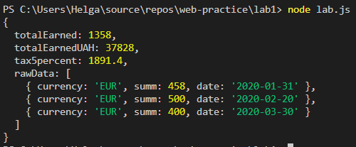
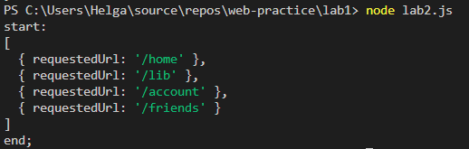
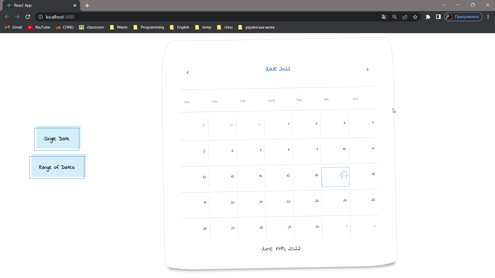
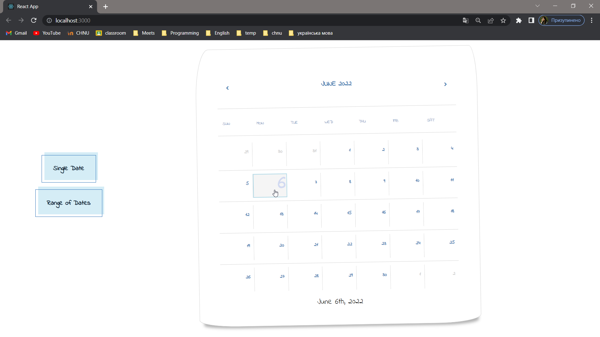
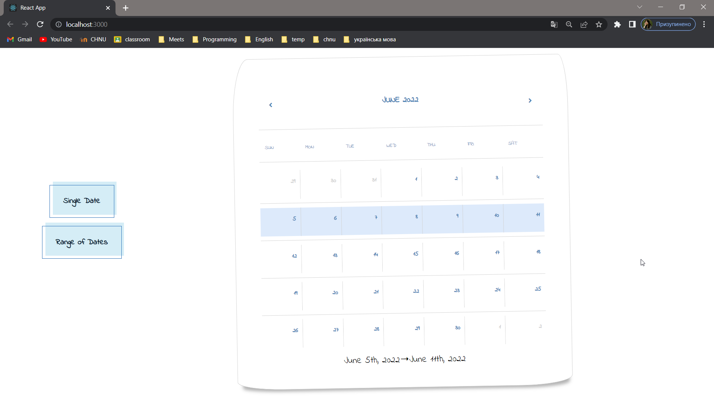

# web-practice
Really big amount of really good labs 

## Usage

**1. Lab 1**

```
npm install
```

lab.js - Calculator for a single tax. To run go to web-practice/lab1:

```
node lab.js
```
##### Results


lab2.js - Consistent execution of requests. To run go to web-practice/lab1:

```
node lab2.js
```
##### Results


**2. Lab 2**

Calendar with the ability to select one date or date range. To run go to web-practice/lab2/my-app and then run:

```
npm install
```

```
npm start
```

Click on button in the left part of your screen to toggle between two date choosing modes.
##### Results



